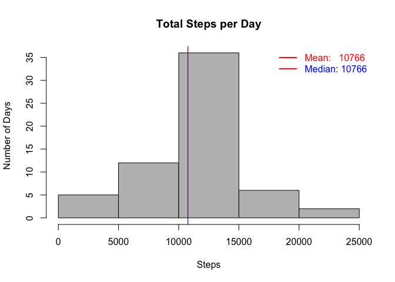
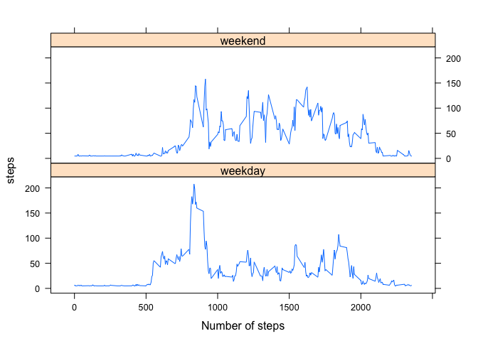

# Reproducible Research: Peer Assessment 1


## Loading and preprocessing the data
Unzip the source data and import it into a data.frame. Cast the date variable to Date format.

```r
    inFile <- "./activity"
    unzip(paste0(inFile, ".zip"))
    data <- read.csv(paste0(inFile, ".csv"), header = TRUE, fill = TRUE, 
                     blank.lines.skip = FALSE, na.strings = "NA")
    data$date <- as.Date(data$date)
```


## What is mean total number of steps taken per day?

Calculate the total number of steps for each day ignoring the missing values. Calculate the ***mean*** and the ***median*** total dayly steps.

```r
    totDlyStps <- aggregate( data = data, steps ~ date, FUN = "sum", na.action = na.omit)
    totStpsMn <- as.integer(round(mean(totDlyStps$steps)))
    totStpsMdn <-  as.integer(round(median(totDlyStps$steps)))
```
- The ***mean*** number of steps per day is : **10766**.
- The ***median*** number of steps per day is : **10765**.


```r
    hist( totDlyStps$steps, col = "gray", main = "Total Steps per Day",
          xlab = "Steps",  ylab = "Number of Days")
    abline(v = totStpsMn, lwd =1, col = "red")
    legend("topright", lwd = 2, lty = 1, text.col = c("red", "blue"), col = c("red"), 
           bty='n', legend = c(paste("Mean:  ", totStpsMn), paste("Median:", totStpsMdn)))
```

 

## What is the average daily activity pattern?

Calculate the avarage steps per day. Get the sampling interval with maximum number of steps. 

```r
    avrgDlyStps <-aggregate( data = data, steps ~ interval, FUN = "mean", na.action = na.omit)
    avrgStpsMaxInt <- avrgDlyStps$interval[which.max(avrgDlyStps$steps)]
```
The interval with maximum average number of steps is : ***835*** .

Plot the avarage daily patern.

```r
    plot(steps ~ interval, data = avrgDlyStps, type = "l", lwd = 2,
         xlab = "Interval",  ylab = "Steps", 
         main = "Average Daily Activity Patern")
    abline(v = avrgStpsMaxInt, lwd = 1, col = "red")
```

 

## Imputing missing values

Calculate how many meesing values

```r
    msngValTot = sum(is.na(data))
    msngValStps = sum(is.na(data$steps))
```
Total number of missing values in the dataset is ***2304*** . Total number or rows with missing values is ***2304***, as well, because all missing values are in the ***steps*** column. 

Substitute all NA values with the average interval value. Calculate the new ***mean*** and ***median*** Total steps values. 

```r
    dataNoNA <- data
    dataNoNA[is.na(dataNoNA)] <- mean(avrgDlyStps$steps)
    totDlyStpsNoNA <- aggregate( data = dataNoNA, steps ~ date, FUN = "sum")
    totStpsMn <- as.integer(round(mean(totDlyStpsNoNA$steps)))
    totStpsMdn <-  as.integer(round(median(totDlyStpsNoNA$steps)))
```
- The ***mean*** number of steps per day is : **10766**.
- The ***median*** number of steps per day is : **10766**.

Imputing the missing values did not change the mean value and made median equal to the mean value for total number of steps.

And the new distribution is:


```r
    hist( totDlyStpsNoNA$steps, col = "gray", main = "Total Steps per Day",
          xlab = "Steps", ylab = "Number of Days")
    abline(v = totStpsMn, lwd =1, col = "red")
    abline(v = totStpsMdn, lwd =1, col = "blue")
    legend("topright", lwd = 2, lty = 1, text.col = c("red", "blue"), col = c("red"), 
           bty='n', legend = c(paste("Mean:  ", totStpsMn), paste("Median:", totStpsMdn)))
```

 

## Are there differences in activity patterns between weekdays and weekends?

Add ***dayType*** factor vatiable with levels ("weekday", "weekend")  and find the avarage steps for each interval for both weekdays and weekends.

```r
    dataNoNA$dayType <- as.factor(ifelse (as.integer(as.character(dataNoNA$date, format = "%u")) < 6, "weekday", "weekend"))
    avrgDlyStps <-aggregate( data = dataNoNA, steps ~ interval + dayType, FUN = "mean", na.action = na.omit)
```
Use ***lattice*** package to create a panel plot of the dayly patern for both weekdays and weekends.

```r
    library(lattice)
    xyplot(steps ~ interval | dayType, data = avrgDlyStps, 
           layout = c(1,2), type="l",  xlab = "Number of steps")
```

 
